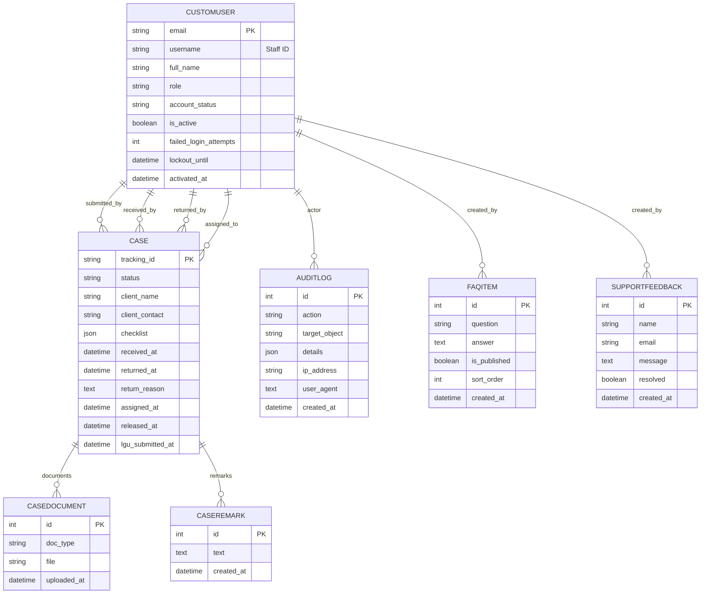

# Software Design Document (SDD)
## LegalTrack (Django Capstone)

**Project:** LegalTrack – LGU Case Submission and Capitol Processing System  
**Repository:** `Capstone`  
**Version:** 1.0  
**Date:** _[fill in]_  
**Prepared by:** _[fill in]_  

---

## Revision History

| Version | Date | Author | Description |
|---|---|---|---|
| 0.1 | _[fill in]_ | _[fill in]_ | Initial draft based on current codebase |
| 1.0 | _[fill in]_ | _[fill in]_ | Final SDD submission |

---

## Table of Contents

1. Introduction
2. System Overview
3. Architectural Design
4. Data Design
5. Detailed Design (Modules & Transactions)
6. Security & Controls
7. Operational Considerations
8. Appendices

---

## 1. Introduction

### 1.1 Purpose
This document describes the software design of **LegalTrack**, a Django-based system that supports:
- LGU (Local Government Unit) **case submission** with document uploads and server-side validation.
- Capitol staff **receiving, assignment, review, approval, numbering, and release** workflow.
- Public **case status inquiry** (search by tracking number, view status summary, view public timeline).
- Public **support information** (FAQ and contact/feedback submission).
- Super Admin **reporting and analytics** (dashboard metrics, report generation, CSV export).
- Centralized **audit logging** and internal **remarks** on cases.

This SDD is derived from the current repository implementation (models, views, forms, templates, settings, and URL routes).

### 1.2 Scope
LegalTrack is a server-rendered web application that provides role-based dashboards and workflow actions.

Included modules:
- **Module 1:** Authentication, onboarding/activation, Super Admin user management, audit logs.
- **Module 2:** LGU case submission wizard, document uploads to `MEDIA_ROOT`, capitol workflow transitions.
- **Module 3:** Submissions list for capitol roles, assignment load visibility, case remarks and history display.
- **Module 4:** Public portal for case tracking and support/FAQ pages.
- **Module 5:** Super Admin analytics dashboard and reporting/export.

### 1.3 Definitions / Acronyms
- **LGU:** Local Government Unit
- **SDD:** Software Design Document
- **MTV:** Model-Template-View (Django pattern)
- **Supabase:** Managed PostgreSQL used as the “supabase” provider via `DATABASE_URL`

### 1.4 References
- Django 5.2 documentation
- Repository files: `legaltrack/settings.py`, `core/models.py`, `core/views.py`, `core/auth_views.py`, `core/backends.py`, `core/middleware.py`, `core/urls.py`, `legaltrack/urls.py`

### 1.5 Overview
The system uses Django’s MTV architecture with server-rendered HTML templates. Data persists to either SQLite or PostgreSQL (Supabase) based on `.env` configuration. Uploaded files are stored on the local filesystem under `MEDIA_ROOT`.

---

## 2. System Overview

### 2.1 User Roles
Roles are implemented in `core.CustomUser.role`:
- `super_admin`
- `lgu_admin`
- `capitol_receiving`
- `capitol_examiner`
- `capitol_approver`
- `capitol_numberer`
- `capitol_releaser`

### 2.2 Primary Workflows
- **LGU Submission (Wizard):** Draft details → upload checklist documents → review & final submit.
- **Capitol Processing:** Receive → assign to examiner → examiner submits for approval → approver approves/returns → numberer marks numbered → releaser releases.
- **Public Tracking:** Search case by tracking number → view status summary → view public timeline.
- **Public Support:** View support landing → view FAQs → submit contact/feedback.
- **Super Admin:** Create/manage staff accounts, resend activation, view/export audit logs.
- **Super Admin Analytics/Reports:** View analytics dashboard → generate internal reports → export CSV.

### 2.3 Major Constraints / Assumptions
- Uploaded case files are stored locally under `media/` (development-friendly).
- Database provider can be switched by editing `.env` (uncomment desired provider).
- The application is primarily server-rendered; `rest_framework` is installed but not required for core flows.

---

## 3. Architectural Design

### 3.1 Architecture Style
- **Pattern:** Django MTV (Model-Template-View)
- **Presentation:** Server-rendered HTML (`core/templates/...`) with standard Django forms and messages.
- **Business Logic:** Primarily in `core/views.py` with helper functions for permissions and validation.
- **Persistence:** Django ORM models in `core/models.py`.

### 3.2 High-Level Component Diagram

```mermaid
flowchart LR
  U[Users\n(LGU Admin / Capitol Staff / Super Admin)] --> B[Web Browser]
  C[Public Client\n(Citizen)] --> B
  B -->|HTTP(S)| DJ[Django App\nlegaltrack + core]

  subgraph DJ[Django Application]
    URLS[URL Router\nlegaltrack/urls.py + core/urls.py]
    V[Views\ncore/views.py + core/auth_views.py]
    F[Forms\ncore/forms.py]
    M[Models\ncore/models.py]
    T[Templates\ncore/templates/...]
    MW[Middleware\nSessionTimeout + ForcePasswordChange]
    AB[Auth Backends\nStaffIdBackend + AdminEmailAliasBackend]
  end

  DJ --> DB[(Database\nSQLite or PostgreSQL/Supabase)]
  DJ --> FS[(Filesystem\nMEDIA_ROOT uploads)]
  DJ --> EMAIL[(Email Backend\nconsole in dev)]
```

### 3.3 Deployment View
Typical development deployment is a single Django server process:
- Django app server (run via `python manage.py runserver`)
- Database: SQLite (`db.sqlite3`) or PostgreSQL via Supabase (`DATABASE_URL`)
- Filesystem: `media/` folder

### 3.4 Configuration Design (DB Toggle)
Configuration is loaded from `.env` in `legaltrack/settings.py`.
- `LEGALTRACK_DB_PROVIDER`: `supabase` or `sqlite`
- `DATABASE_URL`: required when provider is `supabase`

The settings file includes a fallback `.env` parser so the app still runs even if `python-dotenv` is unavailable.

---

## 4. Data Design

### 4.1 Entity Relationship Diagram (ERD)



### 4.2 Key Tables / Fields
- `core.CustomUser`
  - `email` is the Django `USERNAME_FIELD`.
  - `username` stores the generated **Staff ID** (e.g., `25-REC-0001`) used for login via custom auth backend.
  - `account_status`: `pending`, `active`, `inactive` (controls `is_active`).

- `core.Case`
  - `tracking_id` auto-generated as `CEB[YY][MM][#####]`.
  - `checklist` is JSON: list of items with `doc_type`, `required`, `uploaded`.
  - `lgu_submitted_at` is used to gate document edits and indicate final submission.

- `core.CaseDocument`
  - `file` stores uploads under `cases/<tracking_id>/<doc_type>/<filename>`.
  - Unique by `(case, doc_type)`.

- `core.AuditLog`
  - Tracks security and workflow actions with JSON `details`.

- `core.CaseRemark`
  - Internal notes visible on case detail for capitol staff/super admin.

- `core.FAQItem`
  - Stores FAQ question/answer content shown on the public FAQ page.
  - Admin-managed via Django Admin.

- `core.SupportFeedback`
  - Stores public contact/feedback submissions.
  - Admin-managed (with a `resolved` flag).

### 4.3 File Storage Design
Case documents are stored in the local filesystem under `MEDIA_ROOT`:
- `media/cases/<tracking_id>/<doc_type>/<filename>`

---

## 5. Detailed Design (Modules & Transactions)

### 5.1 Module 1 — Authentication, Onboarding, and Administration

#### 5.1.1 Transaction: Staff Login (Staff ID)
- **Actors:** All roles
- **UI:** `core/templates/registration/login.html`
- **Entry URL:** `/accounts/login/` (`LegalTrackLoginView`)
- **Key Components:** `core/auth_views.py`, `core/backends.py`
- **Main Flow:**
  1. User enters Staff ID in the username field.
  2. Authentication is handled by `AdminEmailAliasBackend` (special case) then `StaffIdBackend`.
  3. If password is correct and account not locked, user is logged in.
- **Special Rule:** entering `admin@gmail.com` authenticates the user with that email.
- **Security Controls:**
  - Failed logins increment `failed_login_attempts` and can set `lockout_until`.
  - `AuditLog` records `login_failed` events.

#### 5.1.2 Transaction: Account Activation
- **Actors:** Newly created users
- **UI:** `core/templates/registration/activate_account.html`
- **Entry URL:** `/accounts/activate/<token>/`
- **Main Flow:**
  1. User opens activation link (signed token with 1-hour max age).
  2. System validates token and per-user nonce.
  3. User sets a new password using `AccountActivationForm`.
  4. Account becomes active; `AuditLog` records `activate_account`.

#### 5.1.3 Transaction: Super Admin Creates Staff Account
- **Actors:** `super_admin`
- **UI:** `core/templates/core/user_create.html`, `core/templates/core/user_created.html`
- **Entry URL:** `/users/new/`
- **Main Flow:**
  1. Super Admin enters user’s name and email, chooses Capitol role or LGU municipality.
  2. System generates Staff ID (`CustomUser.save()`), generates a temp password.
  3. Account is stored as `pending` (inactive) and activation link is issued.
  4. `AuditLog` records `create_user` (from model save) and `activation_email_sent` (from view).

#### 5.1.4 Transaction: Password Reset (Throttled)
- **Actors:** Any user
- **UI:** Django auth templates under `core/templates/registration/` (reset form/confirm)
- **Entry URL:** `/accounts/password_reset/`
- **Controls:** password reset requests are throttled using `PasswordResetRequest` within a time window; audit is recorded.

#### 5.1.5 Transaction: Audit Log Viewing/Export
- **Actors:** `super_admin`
- **UI:** `core/templates/core/audit_logs.html`
- **Entry URLs:**
  - View: `/audit-logs/`
  - Export: `/audit-logs/export.csv`
- **Behavior:** filters by action/query, paginates, exports CSV.

#### 5.1.6 Module 1.2 — Admin Onboarding & Authentication (Detailed)

- **Purpose:** describe the end-to-end onboarding flow for staff accounts (creation, activation, temporary credential handling), the authentication backends, and the forced password-change mechanics.
- **Primary Components:**
  - **Views:** `core.views.create_staff_account`, `core.views.user_created`, `core.auth_views.activate_account`, `core.auth_views.set_password_view`, `core.views.resend_activation`
  - **Forms:** `core.forms.StaffAccountCreateForm`, `core.forms.AccountActivationForm`, `core.forms.SetPasswordForm`
  - **Models / Methods:** `core.models.CustomUser`, `CustomUserManager.create_user`, `CustomUser.issue_activation()`, `CustomUser.set_temporary_password()`
  - **Middleware:** `core.middleware.ForcePasswordChangeMiddleware`, `core.middleware.SessionTimeoutMiddleware`
  - **Templates:** `core/templates/core/user_create.html`, `core/templates/core/user_created.html`, `core/templates/registration/activate_account.html`, `core/templates/registration/set_password.html`

- **Sequence (Super Admin creates account):**
  1. Super Admin navigates to `/users/new/` and submits `StaffAccountCreateForm`.
  2. `create_staff_account` view validates input and calls `CustomUser.objects.create()` with `account_status='pending'` and `is_active=False`.
  3. During save, `CustomUser.save()` (or helper) generates a Staff ID (`username`) if missing and stores `temp_password` metadata (not the plaintext) via `set_temporary_password()`; an activation nonce is set.
  4. `create_staff_account` calls `user.issue_activation()` which returns a signed tokenized activation URL (and optionally sends an email using the configured email backend).
  5. View renders `user_created.html` showing the generated Staff ID and, in dev mode, the `activation_link` and temporary password (for manual handoff). An `AuditLog` record `create_user` and `activation_email_sent` are created.

- **Sequence (Activation / First-time set password):**
  1. Staff clicks activation link `/accounts/activate/<token>/`.
  2. `activate_account` verifies the signed token and per-user `activation_nonce` and age (e.g., 1 hour). If valid, it presents `AccountActivationForm` / `SetPasswordForm`.
  3. On successful password set, `CustomUser.account_status` is set to `active`, `is_active=True`, `activated_at` set, and `must_change_password` cleared. `AuditLog` records `activate_account`.
  4. `ForcePasswordChangeMiddleware` remains available to redirect users to `set_password` if `must_change_password=True` at login.

- **Resend Activation:**
  - `resend_activation` view (Super Admin action on user management) calls `user.issue_activation(resend=True)` which rotates/updates the `activation_nonce` and `activation_sent_at`, reissues a new token, sends the email if configured, and logs `activation_email_sent` in `AuditLog`.

- **Security & Validation:**
  - Activation tokens are signed using Django signing and validated with a `max_age` (configurable).
  - Temporary password display is limited to the `user_created` template and only in DEBUG or when explicit workflow requires it — production installs should use email only.
  - `ForcePasswordChangeMiddleware` blocks normal access until `must_change_password=False`.
  - Password complexity is enforced by `core.validators` and Django password hashers (Argon2).

- **Edge Cases / Tests:**
  - Tests must ensure activation tokens expire and invalid/used tokens are rejected.
  - Tests assert that `resend_activation` rotates the nonce and that expired tokens no longer activate the account.
  - Verify audit entries are created for `create_user`, `activation_email_sent`, and `activate_account`.

#### 5.1.7 Module 1.3 — Super Admin Account Maintenance

- **Purpose:** allow `super_admin` users to manage staff accounts: view, edit, deactivate/reactivate, resend activation, and set passwords.
- **Primary Components:**
  - **Views:** `core.views.user_management`, `core.views.create_staff_account`, `core.views.edit_staff_account`, `core.views.resend_activation`, `core.views.toggle_staff_active`, `core.views.set_password_view`
  - **Forms:** `core.forms.StaffAccountUpdateForm`, `core.forms.StaffAccountCreateForm`, `core.forms.SetPasswordByAdminForm`
  - **Models:** `core.models.CustomUser` (fields: `is_active`, `account_status`, `role`, `lgu_municipality`, `activated_at`)
  - **Templates:** `core/templates/core/user_management.html`, `core/templates/core/user_edit.html`, `core/templates/core/user_created.html`

- **Sequence (View/Edit User):**
  1. Super Admin accesses `/users/` → `user_management` view lists users with `is_active`, `role`, and `account_status` and supports search/filter.
  2. Clicking an individual user opens `/users/<id>/edit/` handled by `edit_staff_account` which pre-fills `StaffAccountUpdateForm`.
  3. On POST, validated changes are applied: `role`, `lgu_municipality`, and `is_active` (when toggling a user). `AuditLog` records `update_user` with changed fields.

- **Sequence (Deactivate / Reactivate):**
  1. On deactivation (`toggle_staff_active`), `is_active` is set to `False` and `account_status` set to `inactive`; any active sessions may be invalidated (session cleanup recommended).
  2. On reactivation, `is_active` set to `True` and `account_status` set to `active` (or `pending` if reactivation requires new activation).
  3. Both actions log `deactivate_user` or `reactivate_user` in `AuditLog`.

- **Sequence (Admin-forced Password Set / Reset):**
  1. Super Admin may set a password for a user via `set_password_view` using `SetPasswordByAdminForm`.
  2. Operation updates the hashed password and clears `must_change_password` or sets it depending on policy; logs `set_password_by_admin`.

- **Operational Rules & Safeguards:**
  - A Super Admin cannot remove their own `super_admin` role or deactivate their own account through the UI (prevent accidental lockout). Attempting to do so should return an error.
  - Role changes that reduce privileges are audited and may require a secondary confirmation.
  - Resend activation for already-active users is a no-op or returns a clear message.

- **Audit & Compliance:**
  - All maintenance actions must create `AuditLog` entries with the actor, action, target_object (`User: <email|staff_id>`), and `details` describing the change.
  - Exports of user lists should be permission-restricted and recorded in audit logs.

- **Tests & Validation:**
  - Unit tests for `user_management` listing, search filters, edit/save flows, and toggle actions.
  - Integration tests for `resend_activation` ensuring nonce rotation and email send behavior.
  - Security tests to ensure a user cannot edit or demote themselves via the standard UI.

---

### 5.2 Module 2 — Case Submission and Capitol Workflow

#### 5.2.1 Transaction: Create Case Draft (Wizard Step 1)
- **Actors:** `lgu_admin`
- **UI:** `core/templates/core/submit_case.html`
- **Entry URL:** `/submit/`
- **Main Flow:**
  1. LGU submits case details.
  2. System creates `Case` with status `not_received`.
  3. If provided, “Endorsement Letter” is stored as a `CaseDocument` and added to checklist as required.
  4. `AuditLog`: `case_create`.

#### 5.2.2 Transaction: Upload Checklist Documents (Wizard Step 2)
- **Actors:** `lgu_admin`
- **Entry URL:** `/case/<tracking_id>/step/2/`
- **Rules:**
  - LGU can edit documents only while `not_received` OR when case is `returned`.
  - If the case was finalized previously, document edits are blocked until returned by receiving.
- **Main Flow:**
  1. LGU submits doc types, required flags, and files.
  2. System upserts documents by `(case, doc_type)`.
  3. If case was `returned`, it is set back to `not_received` and `lgu_submitted_at` cleared.
  4. `AuditLog`: `case_update` (step 2).

#### 5.2.3 Transaction: Final Submit (Wizard Step 3)
- **Actors:** `lgu_admin`
- **Entry URL:** `/case/<tracking_id>/step/3/`
- **Server-side Validation:** all checklist items marked `required=True` must have an uploaded `CaseDocument`.
- **Outcome:** sets `lgu_submitted_at=now` and keeps status as `not_received` for receiving to process.

#### 5.2.4 Transaction: Receive Case (Capitol Receiving)
- **Actors:** `capitol_receiving`
- **Entry URL:** `/case/<tracking_id>/receive/` (POST)
- **Precondition:** status is `not_received` or `returned`
- **Outcome:** status → `received`, sets `received_at`, `received_by`; `AuditLog`: `case_receipt`.

#### 5.2.5 Transaction: Return Case to LGU (Capitol Receiving)
- **Actors:** `capitol_receiving`
- **Entry URL:** `/case/<tracking_id>/return/` (POST)
- **Precondition:** status is `not_received`
- **Outcome:** status → `returned`, requires `return_reason`, clears `lgu_submitted_at`; `AuditLog`: `case_status_change`.

#### 5.2.6 Transaction: Assign Case to Examiner (Capitol Receiving)
- **Actors:** `capitol_receiving`
- **Entry URL:** `/case/<tracking_id>/assign/` (POST)
- **Precondition:** status is `received` and `assigned_to` is empty
- **Outcome:** status → `in_review`, sets `assigned_to`, `assigned_at`; `AuditLog`: `case_assignment`.

#### 5.2.7 Transaction: Examiner Submits for Approval
- **Actors:** `capitol_examiner`
- **Entry URL:** `/case/<tracking_id>/submit-for-approval/` (POST)
- **Precondition:** status is `in_review` and case is assigned to the examiner
- **Outcome:** status → `for_approval`; `AuditLog`: `case_status_change`.

#### 5.2.8 Transaction: Approver Approves / Returns for Correction
- **Actors:** `capitol_approver`
- **Entry URLs:**
  - Approve: `/case/<tracking_id>/approve/` (POST)
  - Return: `/case/<tracking_id>/return-for-correction/` (POST)
- **Outcomes:**
  - Approve: status → `for_numbering`; `AuditLog`: `case_approval`
  - Return: status → `returned`, clears assignment; `AuditLog`: `case_rejection`

#### 5.2.9 Transaction: Numbering and Release
- **Actors:** `capitol_numberer`, `capitol_releaser`
- **Entry URLs:**
  - Mark numbered: `/case/<tracking_id>/mark-numbered/` (POST) → status `for_release`
  - Release: `/case/<tracking_id>/release/` (POST) → status `released`, sets `released_at`

---

### 5.3 Module 3 — Submissions List, Remarks, and History

#### 5.3.1 Transaction: View Submissions List
- **Actors:** Capitol roles
- **UI:** `core/templates/core/submissions.html`
- **Entry URL:** `/submissions/`
- **Behavior:**
  - Tab-based filtering by status.
  - Search by tracking ID, client name/contact, and submitter email.
  - Role-based queue constraints (e.g., approver only sees `for_approval`).

#### 5.3.2 Transaction: Assignment UI Shows Examiner Load
- **Actors:** `capitol_receiving`
- **UI:** `core/templates/core/case_detail.html`
- **Behavior:** when assigning, examiner list is annotated with `active_load` (count of assigned cases in `in_review`).

#### 5.3.3 Transaction: Add Internal Remark
- **Actors:** Capitol roles and Super Admin
- **UI:** `core/templates/core/case_detail.html`
- **Entry URL:** `/case/<tracking_id>/remarks/` (POST)
- **Outcome:** creates `CaseRemark` and records `AuditLog` action `case_remark`.

#### 5.3.4 Transaction: View Case History
- **Actors:** All authenticated users (case detail view)
- **UI:** `core/templates/core/case_detail.html`
- **Behavior:** case history is derived from `AuditLog` rows for `target_object = "Case: <tracking_id>"`.
- **Formatting:** audit `details` is rendered in a readable form via `_format_audit_details()`.

---

### 5.4 Module 4 — Public Case Status Inquiry and Support

#### 5.4.1 Transaction: Search Case (Public)
- **Actors:** Citizen (Client)
- **UI:** `core/templates/core/landing.html`, `core/templates/core/track.html`
- **Entry URL:** `/track/?q=<tracking_id>`
- **Main Flow:**
  1. Client enters a Tracking Number.
  2. System validates input and searches for an existing `Case`.
  3. If found, redirects to the case’s public detail page; otherwise shows a not-found page.
- **Postcondition:** A matching case is displayed or the client is informed no match exists.

#### 5.4.2 Transaction: View Case Status Summary (Public)
- **Actors:** Citizen (Client)
- **UI:** `core/templates/core/track_case_detail.html`
- **Entry URL:** `/track/<tracking_id>/`
- **Displayed Data (non-sensitive):**
  - Tracking number
  - Simplified public status label (e.g., Pending, Received, Under Review, Returned for Correction, Released)
  - Last updated timestamp

#### 5.4.3 Transaction: View Case Timeline (Public)
- **Actors:** Citizen (Client)
- **UI:** `core/templates/core/track_case_detail.html`
- **Entry URL:** `/track/<tracking_id>/`
- **Timeline Source:** High-level milestones built from timestamps and selected `AuditLog` events.
- **Privacy Rule:** No internal remarks, staff identities, submitter identity, or documents are exposed.

#### 5.4.4 Transaction: View Help Pages and FAQs
- **Actors:** Citizen (Client)
- **UI:** `core/templates/core/support.html`, `core/templates/core/faq.html`
- **Entry URLs:**
  - `/support/`
  - `/support/faq/`
- **Data Source:** `FAQItem` (published items only).

#### 5.4.5 Transaction: Submit Feedback / Contact Support
- **Actors:** Citizen (Client)
- **UI:** `core/templates/core/feedback.html`
- **Entry URL:** `/support/feedback/` (GET/POST)
- **Outcome:** Creates a `SupportFeedback` row and logs an audit entry (`support_feedback`).

---

### 5.5 Module 5 — Reporting and Analytics

#### 5.5.1 Transaction: View Analytics Dashboard
- **Actors:** Super Admin
- **UI:** `core/templates/core/analytics.html`
- **Entry URL:** `/analytics/`
- **Key Metrics:**
  - Total users
  - Total cases
  - Cases by status
  - Average processing time (Created → Released) for released cases

#### 5.5.2 Transaction: Generate Internal Reports
- **Actors:** Super Admin
- **UI:** `core/templates/core/reports.html`
- **Entry URL:** `/reports/`
- **Report Types:**
  - Status Breakdown
  - Monthly Accomplishment (counts grouped by month)
  - Processing Times (Created → Released)
- **Filters/Parameters:** date range, status, sort order.

#### 5.5.3 Transaction: Export Reports
- **Actors:** Super Admin
- **Entry URL:** `/reports/export.csv` (GET)
- **Output:** CSV based on the selected report type and parameters.

---

## 6. Security & Controls

- **CSRF Protection:** enabled via Django middleware.
- **Session Timeout:** `SessionTimeoutMiddleware` logs out inactive users after 10 minutes.
- **Forced Password Change:** `ForcePasswordChangeMiddleware` can redirect users to `set_password` when flagged.
- **Account Lockout:** after repeated failed logins, `lockout_until` is set and logins are blocked until it expires.
- **Password Policy:** minimum length 12 + custom complexity validator (`core/validators.py`) and Argon2 hashing.
- **Password Reset Throttling:** uses `PasswordResetRequest` and window limits.
- **Audit Trail:** major security and workflow actions are recorded in `AuditLog`.
- **Public Portal Data Minimization (Module 4):** public pages show non-sensitive status/timeline only; internal remarks and staff details are intentionally excluded.

---

## 7. Operational Considerations

### 7.1 Running Locally
- Install dependencies from `requirements.txt`.
- Configure `.env` (choose `LEGALTRACK_DB_PROVIDER` and set `DATABASE_URL` when using Supabase).
- Run migrations: `python manage.py migrate`.
- Start server: `python manage.py runserver`.

### 7.2 Testing Notes
- Automated tests are forced to use SQLite in-memory so test runs stay non-interactive even if Supabase/PostgreSQL is configured.

### 7.3 Backups and Data Retention (Suggested)
- Database backups should be handled by the chosen provider (Supabase PostgreSQL) or local backup procedures (SQLite).
- Uploaded documents in `media/` require filesystem backup strategy.

---

## 8. Appendices

### 8.1 URL Map (Core)
- `/` → `landing`
- `/track/` → `track_case`
- `/track/<tracking_id>/` → `track_case_detail`
- `/support/` → `support`
- `/support/faq/` → `faq`
- `/support/feedback/` → `submit_feedback`
- `/dashboard/` → `dashboard`
- `/submit/` → `submit_case`
- `/case/<tracking_id>/step/<step>/` → `case_wizard`
- `/case/<tracking_id>/` → `case_detail`
- `/case/<tracking_id>/remarks/` → `add_case_remark`
- `/submissions/` → `submissions`
- `/analytics/` → `analytics_dashboard`
- `/reports/` → `reports`
- `/reports/export.csv` → `export_reports_csv`
- `/users/` and subroutes → Super Admin user management
- `/audit-logs/` and `/audit-logs/export.csv` → Super Admin audit

### 8.2 URL Map (Auth)
- `/accounts/login/` → `LegalTrackLoginView`
- `/accounts/logout/` → `logout_view`
- `/accounts/activate/<token>/` → `activate_account`
- `/accounts/password_reset/` → `ThrottledPasswordResetView`
- `/accounts/reset/<uidb64>/<token>/` → `LoggedPasswordResetConfirmView`

### 8.3 Notable Design Decisions
- Staff ID login uses custom auth backends while keeping `CustomUser.USERNAME_FIELD = "email"`.
- `.env`-based DB provider switching supports quick toggling between SQLite and Supabase.
- Required checklist items are enforced server-side at the final submit step.
- LGU document edits are blocked after final submit unless the case is returned by Capitol Receiving.
- Module 4 public tracking is intentionally read-only and excludes sensitive/internal data.
- Module 5 reports support CSV export for offline review.
